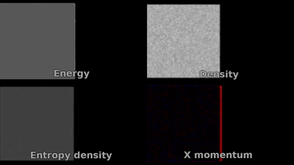

Code to solve for the (almost) exact time evolution of a large system of rigid spheres undergoing elastic collision. 

Example of 1m particles evolving over time in a free expansion setup:

It's "almost" exact because only one collision can be handled per particle per timestep. This is good enough for very rarified gases, but it would be a problem 
for higher densities.

The goal is to get something working and make some quick molecular dynamics videos. I'm not going to worry about the exact solution / exact event driven molecular dynamics code. 
It would be fun to scale it up to billions of particles on a GPU, but I'll save that for later!

For a given particle at position $x_i$, we only have a collision if $\Delta x_{ij}\cdot \Delta v_{ij}\lt 0$, $\Delta x^2\gt r^2$ (which I should always enforce, but maybe an initial condition is given where the particles overlap), and $(\Delta x\cdot \Delta v)^2-\Delta v^2(\Delta x^2-r^2)\gt 0$. 

Let's divide into a grid of M by M cells. We evolve by time $\Delta t$, and delta t should be small enough that we usually have 0 collisions, rarely have 1 collision, and almost never have 2 collisions (which I won't try to handle properly!)

Physics/writeup TODO:
- [ ] Write the relevant formulas for the grand canonical ensemble. $\Xi(\mu,\beta)$, $S$, $w(r,p,N)$ and so on. Make sure I have a good definition of the mean free path, packing fraction, and so on.
- [ ] Choose an appropriate $z_1(T_{ref})$ / entropy reference point. (Is there a nice "natural units" choice for absolute entropy anyways?)
- [ ] Write out my estimate for entropy production as opposed to entropy generation ($H(r)=\int d^d p f\log(f/f_0)$, $\dot{H}$ can be measured and the piece of $\dot{H}$ due to transport is $-\nabla \cdot \int d^d p (\vec{p}/m) f\log(f/f_0)$).
- [ ] Write out the proof for the MLE of $\beta$ and $\overline{n}$ which are just what you expect (1/beta is just the average energy up to scale factors, $\overline{n}$ is just the average number of observed particles, and this can be justified + error bars with Bayesian stats). 
- [ ] Figure out estimates for $\grad \overline{n}$ and $\grad \beta$, if I need em.
- [ ] Do the math on magic numbers: what's the relation between `T`, `dt`, `maxh`, and so on such that we don't miss collisions + don't have too many multiple collisions? What are some quick checks that we're getting good data? How do I scale things if I say "I want the same physical scenario, but with double the particles"?

Coding TODO:
- [x] Simplify iteration over PGrid and remove all the duplicated looping code.
- [ ] Write robust PGrid iterator tests.
- [ ] Run more tests on PGrid.h to ensure it's written correctly and satisfies the right guarantees.
- [ ] Add a "bresenham circle" algorithm for image drawing.
- [ ] Put the magic numbers & image configuration into configuration structs. 
- [ ] Add command line arguments so that it's easier to run quick tests with 10k particles or slow ones with 1m, verbose or non-verbose output, etc.
- [ ] Add support for a time-dependent boundary condition.
- [ ] Add timing benchmarks, hopefully we should be linear in N.
- [ ] Optimization 1: See if I can get rid of newpos,newvel and if that speeds things up.
- [ ] Optimization 2: See if modifying PGrid.h to have an std::array instead of a std::vector speeds things up (max particle #), and see how often we reach that maximum density.
- [ ] Optimization 3: See if modifying PGrid.h to move particles in-place helps (eg. cache locality).
- [ ] Do a proper time-dependent Bayesian estimation on (px,py,E,n,beta,s).
- [ ] Do a small-scale test to plot $\Delta S(v)$ for varying velocities.

